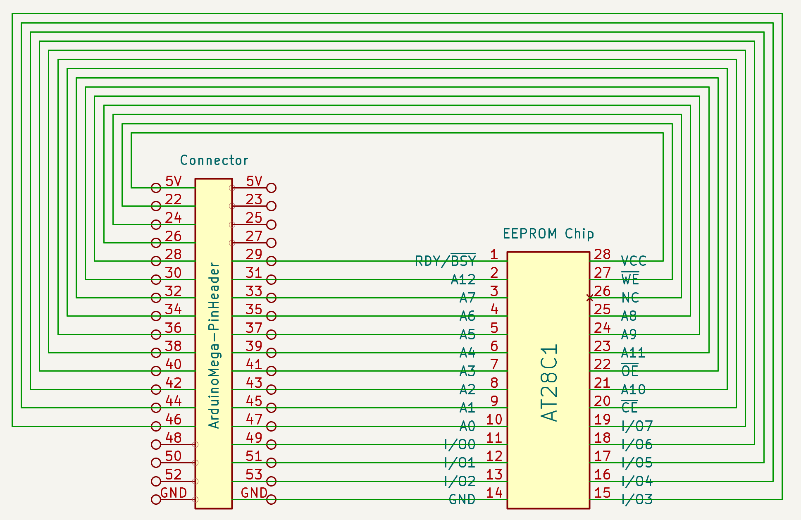

# EEPROM Programmer

> Note: this project concerns external EEPROM chips, not the built-in Arduino EEPROM memory.

## TLDR

🚧 WIP 🚧


## Wiring Diagram



## EEPROM Programmer on Arduino

set pins layout in `eeprom_wiring.h`

Programmer interface:
```cpp
// initialize chip pinout 
ErrorCode init_chip(const String& chip_type);

// set read mode
ErrorCode set_read_mode(const int page_size_bytes);

// read one page
ErrorCode read_page(const int page_no, uint8_t* bytes);

// set write mode
ErrorCode set_write_mode(const int page_size_bytes);

// write one page
ErrorCode write_page(const int page_no, const uint8_t* bytes);
```

### JSON-RPC API

Arduino IDE's *Serial Monitor* on `115200` baud

`init_chip(chip_type: str)`

```json
{"jsonrpc":"2.0", "id":0, "method": "init_chip", "params": ["AT28C64"]}
```

`set_read_mode(page_size_bytes: int)`

```json
{"jsonrpc":"2.0", "id":0, "method": "set_read_mode", "params": [4]}
```

`read_page(page_no: int)`

```json
{"jsonrpc":"2.0", "id":0, "method": "read_page", "params": [0]}
```

`set_write_mode(page_size_bytes: int)`

```json
{"jsonrpc":"2.0", "id":0, "method": "set_write_mode", "params": [4]}
```

`write_page(page_no: int, data: array[int])`

```json
{"jsonrpc":"2.0", "id":0, "method": "write_page","params": [0, [127, 127, 127, 127]]}
```

#### Write Operation Sequence

```json
{"jsonrpc":"2.0", "id":0, "method": "init_chip", "params": ["AT28C64"]}
{"jsonrpc":"2.0", "id":0, "method": "set_write_mode", "params": [4]}
{"jsonrpc":"2.0", "id":0, "method": "write_page","params": [0, [127, 127, 127, 127]]}
```

#### Read Operation Sequence

```json
{"jsonrpc":"2.0", "id":0, "method": "init_chip", "params": ["AT28C64"]}
{"jsonrpc":"2.0", "id":0, "method": "set_read_mode", "params": [4]}
{"jsonrpc":"2.0", "id":0, "method": "read_page", "params": [0]}
```


## EEPROM Programmer python CLI

Uses the [Serial JSON RPC](https://github.com/inn-goose/serial-json-rpc-arduino) interface.

### init CLI

```bash
pip3 install virtualenv

PATH=${PATH}:~/Library/Python/3.9/bin/ ./env/init.sh

source venv/bin/activate

deactivate
```

### Usage

```bash
python -m serial.tools.list_ports
...
/dev/cu.usbmodem2101
```

#### prepare data

```bash
mkdir ./tmp

# get a "real" EEPROM dump
curl -LJ --output tmp/zenith_zt1_eeprom.bin "https://github.com/misterblack1/zenith_zt1/raw/refs/heads/main/444-187%20U114%20ROM%202732.bin"
```

#### read

```bash
source venv/bin/activate

# read data from file
PYTHONPATH=./eeprom_programmer_cli/:$PYTHONPATH python3 ./eeprom_programmer_cli/cli.py /dev/cu.usbmodem2101 -p AT28C64 --read tmp/dump_eeprom.bin

# convert to HEX
xxd tmp/dump_eeprom.bin > tmp/dump_eeprom.hex
```

#### erase

```bash
source venv/bin/activate

# erase with FF pattern
PYTHONPATH=./eeprom_programmer_cli/:$PYTHONPATH python3 ./eeprom_programmer_cli/cli.py /dev/cu.usbmodem2101 -p AT28C64 --erase ff
```

#### write

```bash
source venv/bin/activate

# write data from file
PYTHONPATH=./eeprom_programmer_cli/:$PYTHONPATH python3 ./eeprom_programmer_cli/cli.py /dev/cu.usbmodem2101 -p AT28C64 --write tmp/zenith_zt1_eeprom.bin
```


## XGecu Programmer as a Reference

```bash
brew install minipro

# write the "real" dump to the chip
minipro -p AT28C64 -s -u -w tmp/zenith_zt1_eeprom.bin

# read the data
minipro -p AT28C64 -u -r tmp/dump_xgecu.bin

# convert to HEX
xxd tmp/dump_xgecu.bin > tmp/dump_xgecu.hex

# compare
vimdiff tmp/dump_eeprom.hex tmp/dump_xgecu.hex
```


## Tests

### Read Noise

```bash
# read w/o reset
PYTHONPATH=./eeprom_programmer_cli/:$PYTHONPATH python3 ./eeprom_programmer_cli/cli.py /dev/cu.usbmodem2101 -p AT28C64 -r tmp/dump_eeprom.bin --attempts 3

# read w/ reset
for i in `seq 1 3`; do PYTHONPATH=./eeprom_programmer_cli/:$PYTHONPATH python3 ./eeprom_programmer_cli/cli.py /dev/cu.usbmodem2101 -p AT28C64 -r tmp/dump_eeprom_$i.bin; done

# convert to HEX
for i in `seq 1 3`; do xxd tmp/dump_eeprom_$i.bin > tmp/dump_eeprom_$i.hex; done

# compare

vimdiff tmp/dump_eeprom_[1,3].hex

vimdiff tmp/dump_eeprom_*.hex

vimdiff tmp/dump_eeprom_1.hex tmp/dump_xgecu.hex
```
